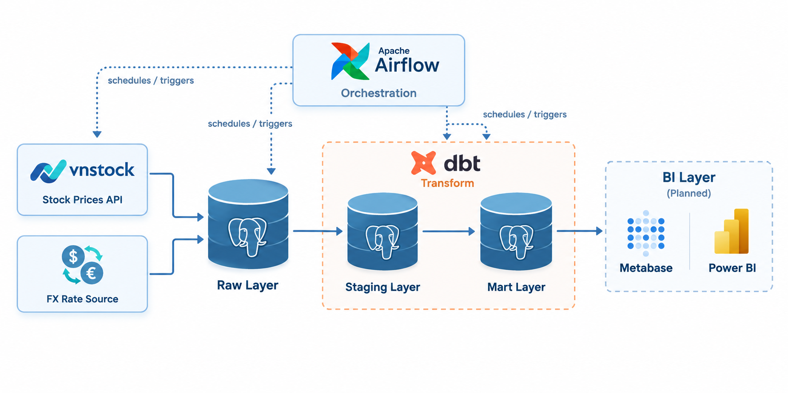

# Finance ELT Pipeline — VN Stock & FX Data Pipeline

An end-to-end ELT (Extract–Load–Transform) pipeline for Vietnamese bank stock prices and USD/VND exchange rate data, built as a hands-on portfolio project for a Data Engineer role.

## Project Goal

This project is a learning-by-building exercise that simulates a realistic data platform workflow: ingest public financial data, land it in a warehouse, model it through clean layers, and (eventually) surface it for BI consumption. The focus is on applying standard data engineering practices — orchestration, layered transformation, testing, and containerized local development — rather than on the financial data itself.

Target stocks: Vietnamese bank tickers **VCB, TCB, ACB, BID, LPB**, sourced via the [vnstock](https://github.com/thinh-vu/vnstock) library, plus USD/VND exchange rate data.

## Architecture

Data flows through three layers, following a standard raw → staging → mart modeling approach:



- **Raw** — stores the original API response as-is (minimal transformation), for traceability and re-processing.
- **Staging** — dbt models that clean data types, deduplicate records, and standardize column names/formats.
- **Mart** — business-facing tables joining stock prices with FX rates, shaped for BI queries.

## Tech Stack

| Layer | Tool | Status |
|---|---|---|
| Orchestration | Apache Airflow | Planned |
| Transformation | dbt-core | Planned |
| Data ingestion | Python, [vnstock](https://github.com/thinh-vu/vnstock) | Planned |
| Warehouse | PostgreSQL | Planned |
| Local environment | Docker Compose | Planned |
| BI / Visualization | Metabase or Power BI | Planned |
| CI/CD | GitHub Actions | Planned |

The repository is at its very first stage: only the license and project documentation exist so far. No implementation code has been written yet — the table above reflects the intended stack rather than what is currently installed or running.

## Repository Structure

The directory skeleton below is in place, but each folder is currently empty (tracked with `.gitkeep`) — implementation has not started yet.

```
finance-elt-pipeline/
├── dags/       # Airflow DAGs orchestrating extraction and dbt runs
├── dbt/        # dbt project: staging and mart models, tests, docs
├── docker/     # Dockerfiles and Docker Compose setup for local development
├── scripts/    # Standalone extraction/ingestion scripts (e.g. vnstock, FX pulls)
└── docs/       # Project documentation, design notes, diagrams
```

## Running Locally

Not available yet. A `docker-compose.yml` bringing up Airflow, Postgres, and dbt for local development has not been created. This section will be filled in once the Docker Compose setup lands.

## Current Status & Roadmap

**Phase 0 — Repository setup**
- [x] Initialize repository, add license
- [x] Write project README
- [x] Scaffold project structure (`dags/`, `dbt/`, `docker/`, `scripts/`, `docs/`)

**Phase 1 — Environment & ingestion**
- [ ] Set up Docker Compose (Airflow + Postgres)
- [ ] Build ingestion scripts for stock prices (vnstock) and USD/VND FX rate
- [ ] Load raw responses into the Postgres raw layer
- [ ] Orchestrate ingestion with an Airflow DAG

**Phase 2 — Transformation**
- [ ] Set up dbt project against the warehouse
- [ ] Build staging models (typing, cleaning, deduplication)
- [ ] Build mart models (price + FX joins)
- [ ] Add dbt tests and generate dbt docs

**Phase 3 — BI & CI/CD**
- [ ] Connect Metabase or Power BI to the mart layer
- [ ] Add GitHub Actions for CI (linting, dbt tests)

This roadmap will be updated as each phase is completed.

## Author / Contact

**Nguyễn Anh Kiệt**
GitHub: [@anhkiet07](https://github.com/anhkiet07)
